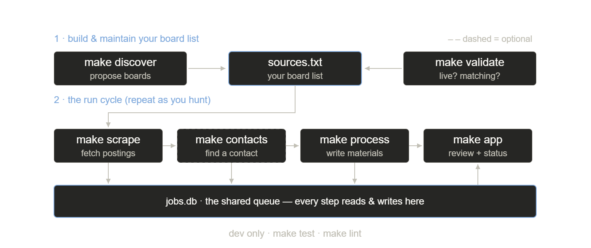

# Architecture

> Status: reflects what's actually implemented as of the initial skeleton (storage + one scraper + LLM wrapper + dashboard). Sections marked **(TODO)** describe intent, not working code yet.

## Layers

```
ingestion  →  storage  →  llm  →  app
(scrapers)    (SQLite)    (Ollama)  (Streamlit)
```

Each layer only talks to the one next to it. `app/main.py` never imports a scraper; `ingestion/` never imports Streamlit. The database is the seam between all of them — every layer reads/writes `JobPost` rows and nothing else.

## The three design decisions

### 1. Strategy Pattern for scrapers

`src/ingestion/base_scraper.py` defines `BaseScraper`, an `abc.ABC` with one abstract method: `scrape() -> List[JobPost]`. There are two concrete implementations: `src/ingestion/seek.py` (SEEK public RSS) and `src/ingestion/greenhouse.py` (Greenhouse public board JSON API).

The contract is deliberately thin — a scraper takes whatever constructor args it needs and returns a list of `JobPost` objects. It's a pure fetcher: it doesn't talk to the database, and it doesn't know about filters. `src/ingestion/planner.py` (`plan_scrapes`) is the one place that turns validated `sources` + `filters` into concrete scrapers, so the CLI loops over `PlannedScrape` items without knowing their concrete types. (`src/ingestion/factory.py` is now a thin deprecation shim re-exporting the planner.)

What you want (titles, locations) is kept separate from where you look (sources), because the two source kinds use the intent differently: SEEK is a search engine, so each `(title, location)` pair becomes one search; an ATS board returns a company's whole list, so the planner marks it for post-filtering by `src/ingestion/filtering.py`.

Why this matters in practice: if SEEK changes its RSS feed format, only `seek.py` changes. The Greenhouse and Lever scrapers prove the abstraction holds — totally different transports (JSON APIs vs. RSS), yet `BaseScraper`, the CLI, and storage didn't change shape to absorb them. Adding a source (see `docs/scrapers.md`) is a new file, a config model, and one branch in the planner.

### 2. Database-backed queue instead of asyncio

The original plan considered an asyncio worker so the LLM wouldn't block Streamlit's UI thread. That was dropped: Streamlit's threading model fights background workers that try to push updates into the UI, and the added complexity (race conditions, shared state) wasn't worth it for what this pipeline needs.

Instead:

- `make scrape` (`src/ingestion/cli.py`) writes `JobPost` rows. New rows have `generated_cover_letter = None` by construction.
- `make process` (`src/llm/cli.py`) calls `pending_llm_jobs()` (`src/storage/database.py`) to find rows where `generated_cover_letter IS NULL`, generates materials, writes them back.
- `make app` (`src/app/main.py`) only ever reads, plus writes simple status-field updates (`To Apply` → `Applied` → ...).

No process talks to another process directly. The database is the queue. This is slower than an in-memory queue but there is no in-flight state to lose, and any step can be re-run safely.

### 3. LLM abstraction layer

`src/llm/client.py` defines `LLMClient` (ABC, one method: `generate(prompt: str) -> str`) and `OllamaClient`, the only implementation. `get_llm_client(config)` is a factory that picks a backend based on `config.yaml`'s `llm.backend` key.

Today `backend: ollama` is the only valid value — anything else raises `ValueError` with a message pointing at what to do about it. Adding a second backend means adding a subclass and one `elif` branch in the factory; nothing in `cli.py` or `prompts.py` needs to change. See `docs/llm-providers.md`.

## Data flow, end to end



1. `make scrape` → `plan_scrapes(sources, filters)` expands SEEK sources into one search per `(title, location)` and marks ATS boards for post-filtering → each planned scrape runs, ATS results are filtered by `job_matches()` → `upsert_job()` dedupes against `job_board_id` and inserts new rows. One planned scrape failing is logged and skipped, not fatal.
2. `make process` → `pending_llm_jobs()` finds rows with no cover letter → `OllamaClient.generate()` is called twice per job (cover letter, cold email) using templates from `src/llm/prompts.py` → results written back to the same row.
3. `make app` → Streamlit reads all rows, renders one expander per job, lets you change `status` inline.

## What's deliberately not built yet

- A second LLM backend (the LLM layer is held at one backend on purpose; the backend choice itself is still open)
- Retry/backoff around **LLM** calls — scrapers now have a small retry helper (`src/ingestion/http_util.py`), but `OllamaClient` does not
- Resume parsing — `resume_summary` in `config.yaml` is a hand-written string, not extracted from a file (left alone as part of the LLM/prompt path)
- A live-Postgres test run — `database.url` is wired and the engine is built from it, but the suite has only been exercised against SQLite (see `docs/roadmap.md`)

## Storage backend: SQLite vs. Postgres

SQLite is the product; Postgres is a documented escape hatch that would need a real test pass before you trusted it. The storage layer goes through SQLModel/SQLAlchemy, so the database URL isn't hardcoded and *can* point at Postgres — but that's optionality, not a validated feature. The Postgres path has never been run here and no non-SQLite driver (e.g. `psycopg`) is pinned. For a single-user job tracker, SQLite has ample headroom; Postgres earns its keep only with concurrent writers or a shared/hosted deployment, none of which is on the table today. See `TODO.md` for what a real Postgres pass would require.

## (TODO) Deployment

Nothing here yet. The project currently assumes local SQLite + local Ollama. A Docker Compose setup for Postgres + a containerized app is mentioned as a stretch goal but has no implementation — and would depend on the Postgres verification above.
